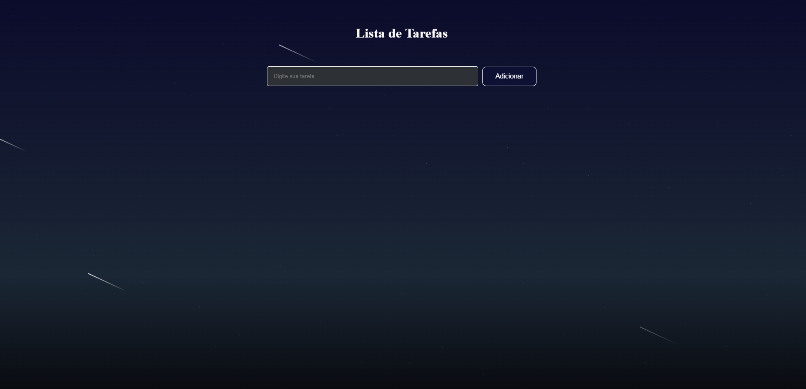

# To-do-List
# 📝 To-Do List

Projeto de Lista de Tarefas desenvolvido com HTML, CSS e JavaScript.

## 🚀 Sobre o Projeto

Este projeto foi criado com o objetivo de praticar conceitos fundamentais do desenvolvimento Front-end, como:

* Manipulação do DOM
* Eventos em JavaScript
* Estruturas de repetição
* Condicionais
* Organização de layout com CSS
* Responsividade
* Validação de tarefas

A aplicação permite adicionar tarefas dinamicamente e melhorar a organização do usuário de forma simples e intuitiva.

---

## 💻 Tecnologias Utilizadas

* HTML5
* CSS3
* JavaScript

---

## 📸 Preview


```md

```

---

## ⚙️ Funcionalidades

* ✅ Adicionar tarefas
* ✅ Validação de campo vazio
* ✅ Exibição dinâmica das tarefas
* ✅ Interface simples e responsiva
* ✅ Organização visual moderna

---

## 📚 Aprendizados

Durante o desenvolvimento deste projeto, pratiquei:

* Lógica de programação
* Manipulação de elementos HTML com JavaScript
* Criação de funções
* Eventos de clique
* Estruturação de projetos Front-end
* Boas práticas de estilização

---

## 🔗 Acesse o Projeto


```md
https://luizsansilv.github.io/To-do-List/
```

---

## 👨‍💻 Autor

Luiz Henrique

* GitHub: [https://github.com/luizsansilv](https://github.com/luizsansilv)
* LinkedIn: www.linkedin.com/in/lz-henrique

---

## 📌 Status do Projeto

🚧 Em desenvolvimento e recebendo melhorias.
